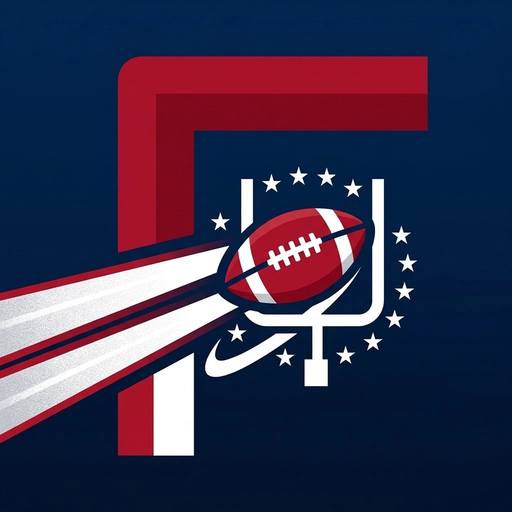

<p align="center"></p>

# FootMob

> **Credit where it's due: this app is built on FotMob's idea.** See [Credits & inspiration](#credits--inspiration).

A FotMob-style matchday app for **American football**: live scores, fixtures, standings, match stats and personalized news for the **NFL** and **college football (FBS)**. It's built for **iOS 26** and runs on your iPhone for **$0**.

| | |
|---|---|
| **Matches** | Week picker, your teams first, then live games, then games grouped by day. Rows refresh every 20 s while games are live. Top 25 filter for college. |
| **Match centre** | Team-colour hero header, live field-position graphic with down & distance, quarter-by-quarter linescore, win-probability chart, scoring summary, game leaders, team stat comparison bars, drive-by-drive play-by-play, and the division/conference table. |
| **Leagues** | NFL division tables and FBS conference tables (seeds, clinch markers, PCT, point differential, streak), plus this week's schedule and league news. |
| **Following** | Glass tiles for your teams showing their live, next or last game. Each team page has its schedule and news. |
| **News** | A "For You" feed ranked by your teams and how recent each story is, with an **on-device AI briefing** (Apple Foundation Models) and a secure in-app reader (Safari's viewer). |
| **Search** | Teams across both leagues and this week's games. |

### Home Screen, Lock Screen and system features

- **Scores widget** (small, medium, large, and Lock Screen circular, rectangular and inline). It shows today's games with your teams first. It has a refresh button and a button on each game that starts a Live Activity from the widget.
- **My Team widget**: your team's live score, next kickoff or last result, with a **Go Live** button.
- **Top Stories widget**: news headlines with thumbnails.
- **Live Activities**: the score, clock, down & distance, a field graphic and the last play show on the Lock Screen and in the **Dynamic Island**. They also appear in StandBy, CarPlay and the Apple Watch Smart Stack. You get an alert when someone scores.
- **Control Center / Lock Screen / Action Button controls**:
  - **Live Scores** opens straight to the games in progress.
  - **Track My Team** is the one-tap "live button". It starts a Live Activity for your team's current or next game.
- **Siri & Spotlight**: "Show live scores in FootMob" and "Track my team in FootMob".

### 2026 iOS design

- **Liquid Glass** throughout: `glassEffect`, `GlassEffectContainer`, and the `.glass` / `.glassProminent` button styles.
- The tab bar **minimizes when you scroll down**. There's a separate **Search tab**, and a **bottom accessory** shows the live game above the tab bar.
- **Dark mode**: a System / Light / Dark choice in **Following → Settings**. Dark mode uses a deep navy-black background taken from the app icon. Team colours adjust automatically, so near-black colours like the Cowboys' navy switch to the team's alternate colour instead of disappearing.
- `MeshGradient` team-colour headers, SF Symbol animations, numeric score transitions, and haptics when a team scores.
- Widgets support the tinted and clear Home Screen styles (`widgetAccentable`, accented rendering modes).
- Interactive widgets, controls and Live Activities are all driven by **App Intents**.
- An on-device LLM (**Foundation Models**) writes the news briefing.

---

## What it costs: nothing

| Piece | Cost | Notes |
|---|---|---|
| Scores, stats, standings, news | Free | ESPN's public JSON endpoints. No API key or sign-up. |
| AI briefing | Free | Runs on the iPhone (Apple Intelligence devices). Other devices show plain headlines. |
| Backend server | None | Nothing to host. All updates come from the device. |
| Installing on your iPhone | Free | A free Apple ID in Xcode is enough. You don't need the $99 Apple Developer Program. |
| Tools | Free | Xcode 26 and XcodeGen. |

**Limits of the free route (worth knowing):**

- **7-day re-signing.** Apps installed with a free Apple ID expire after 7 days. Plug in your phone and press ▶︎ in Xcode again to renew. Your favourites are kept.
- **Live Activity updates.** Without a push server (which needs the paid program), Live Activities update in four cases: while FootMob is open, when a widget refreshes, when you tap a widget or control, and when iOS runs FootMob's background refresh. Background refresh typically happens every few minutes to an hour, and iOS decides the timing. Scores stay reasonably current but not second-by-second while the phone is locked.
- **ESPN's API is unofficial.** It's fine for personal use, but it can change without notice and it isn't licensed for an App Store release. All data access goes through the `SportsDataProvider` protocol, so a licensed feed can be swapped in later.

---

## Run it on your iPhone

You need a **Mac** with **Xcode 26** (free from the Mac App Store) and an **iPhone on iOS 26**.

1. **Install XcodeGen** (generates the Xcode project from `project.yml`):
   ```sh
   brew install xcodegen
   ```
2. **Make the IDs yours.** Open `project.yml` and change these two lines to something unique:
   ```yaml
   BUNDLE_ID_PREFIX: com.yourname.footmob
   APP_GROUP_ID: group.com.yourname.footmob
   ```
3. **Generate and open the project:**
   ```sh
   xcodegen generate
   open FootMob.xcodeproj
   ```
4. **Sign in with your free Apple ID.** Go to Xcode → Settings → Accounts → **+** → Apple ID.
5. **Pick your team.** For **both** targets (`FootMob` and `FootMobWidgets`), open **Signing & Capabilities** and choose *Your Name (Personal Team)*.
6. **Enable Developer Mode on the iPhone** (Settings → Privacy & Security → Developer Mode), plug the phone in, select it as the run destination, and press **▶︎**.
7. **Trust yourself** the first time: on the iPhone, go to Settings → General → VPN & Device Management → your Apple ID → **Trust**.

Then long-press the Home Screen to add the FootMob widgets. To add the **Live Scores** and **Track My Team** buttons, go to Control Center → **+** → FootMob.

> **If signing fails on the App Group:** delete the App Groups capability from both targets and run again. FootMob still works. Widgets fetch their own data, and you pick the team in the My Team widget's settings instead of it reading your favourites automatically.

### Tests

The data layer (`Packages/FootMobKit`) has Swift Testing tests. They check decoding against ESPN fixture JSON, standings sorting, date parsing, deep links and the personalization ranking.

```sh
cd Packages/FootMobKit && swift test     # or ⌘U in Xcode
```

---

## Project layout

```
project.yml                 XcodeGen spec (app + widget extension)
Packages/FootMobKit/        Shared data layer used by the app and widgets
  Models/                   League, Team, Game, GameDetail, Standings, Article
  Networking/               SportsDataProvider protocol + free ESPN client & mapping
  Storage/                  App Group storage, snapshots, image cache, deep links
  Personalization/          Game prioritization and "For You" news ranking
  LiveActivity/             ActivityKit attributes + start/update/end controller
App/                        SwiftUI app (Matches, Match centre, Leagues, Following, News, Search)
Shared/Intents/             App Intents shared by app & widgets (config, Go Live, controls)
Widgets/                    Scores, My Team, Top Stories widgets, Live Activity, Controls
```

## Security & privacy

FootMob has no accounts, ads, analytics or tracking, and it stores no secrets. There are no API keys in the code to leak. The protections below are built in; [SECURITY.md](SECURITY.md) has the full list and how to report a problem.

- **HTTPS only.** App Transport Security has no exceptions. Requests use a stateless session: no cookies, no credential storage, no disk cache, TLS 1.2 or newer, strict timeouts and a size cap on every response.
- **Untrusted input is validated.** Anything that arrives from outside can be hostile: `footmob://` deep links, widget, Siri and Control Center parameters, and URLs inside API responses. IDs must be short alphanumerics, which blocks path traversal and URL injection. Images load only from ESPN's HTTPS image hosts. Article deep links must point at ESPN.
- **Web pages are sandboxed.** Articles open in `SFSafariViewController`, which runs in Safari's own process. FootMob can't read or change those pages, they don't share cookies with the app, and Safari's fraud warnings still apply.
- **Files are encrypted at rest.** Cached scores, news and images use iOS file protection (*complete until first unlock*).
- **Privacy manifests** declare no tracking and no collected data for both the app and the widgets.
- **The AI briefing never runs code.** Headlines go to the on-device model as plain text, and its answer is shown as plain text, so a hostile headline can't trigger links or actions.

## Credits & inspiration

**FootMob exists because of [FotMob](https://www.fotmob.com).** The idea and most of the execution are theirs:

- the matchday-first layout, with your teams' games at the top
- the match centre, with live stats, events and the league table in context
- clean league tables, following teams, and personalized news

FotMob built all of that for football (soccer), and it's one of the best sports apps on any platform. FootMob is a fan-made tribute that applies their approach to the NFL and college football. The app has a credits screen too (**Following → Settings → About & Credits**).

### Download FotMob

If you watch soccer at all, get the real thing. It's free:

- **iPhone / iPad:** [search "FotMob" on the App Store](https://apps.apple.com/us/search?term=fotmob)
- **Android:** [FotMob on Google Play](https://play.google.com/store/apps/details?id=com.mobilefootie.wc2010)
- **Web:** [fotmob.com](https://www.fotmob.com)

*FootMob is an independent, non-commercial project. It is not affiliated with, endorsed by or sponsored by FotMob. FotMob is a trademark of its owner.*

**Also thanks to:**
- **ESPN** for the public score, stats and news data (FootMob isn't affiliated with ESPN).
- **The NFL, the NCAA, and their clubs and schools.** Team names, logos and league marks belong to them.

## Using a different data source

Implement `SportsDataProvider` and pass it to `AppModel(provider:)`:

```swift
struct MyFeed: SportsDataProvider { /* scoreboard, gameDetail, standings, news, teams, schedule */ }
```
